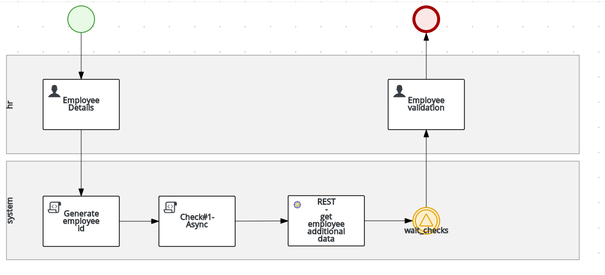

jbpm-spring-boot example
=============================

Example of a jbpm service with spring boot.<br>
The project is compose by a kjar, representing a sample new-hire BPMN process and by a kie-server running on spring boot.<br>

This is an image showing the BPMN process:


## Prerequisites

You need an existing PAM business central listening at localhost:8080 (for monitoring the kie server).<br>
You need to define these two properties for the business central in order to monitor the kie-server:
```bash
<property name="org.kie.server.user" value="user"/>
<property name="org.kie.server.pwd" value="user"/>
```

## Install the kjar in your .m2 repo

```bash
  cd new-hire-kjar
  mvn clean install
```

## Define the kie server properties

The list of kie containers (groupId, artifactId version) to deploy at startup must be defined inside the new-hire-service.xml file.<br>
The kjars must exists inside your local .m2 maven repository.

Several application.properties are defined, each one with a specific database configuration:
 - h2 (default)
 - mysql
 - postgres
 - oracle

You can configure the user/password to connect with the controller (Business Central) through the following system properties inside the new-hire-service.xml file:

```bash
 org.kie.server.controller.user=<user>
 org.kie.server.controller.pwd=<password>
```


## Run a kie-server and deploy a kjar

```bash
  cd new-hire-service
  mvn spring-boot:run -Dorg.kie.server.startup.strategy=LocalContainersStartupStrategy
```

## Run a kie-server and deploy a kjar with mysql dbms

```bash
  cd new-hire-service
  mvn spring-boot:run -Dorg.kie.server.startup.strategy=LocalContainersStartupStrategy -Pmysql
```

## Run a kie-server and deploy a kjar with postgres dbms

```bash
  cd new-hire-service
  mvn spring-boot:run -Dorg.kie.server.startup.strategy=LocalContainersStartupStrategy -Ppostgres
```

## Run a kie-server and deploy a kjar with oracle dbms

```bash
  cd new-hire-service
  mvn spring-boot:run -Dorg.kie.server.startup.strategy=LocalContainersStartupStrategy -Poracle
```

## Postman collection

A postman collection for testing the API is available inside postman directory.

```bash
cd new-hire-service/postman
```
